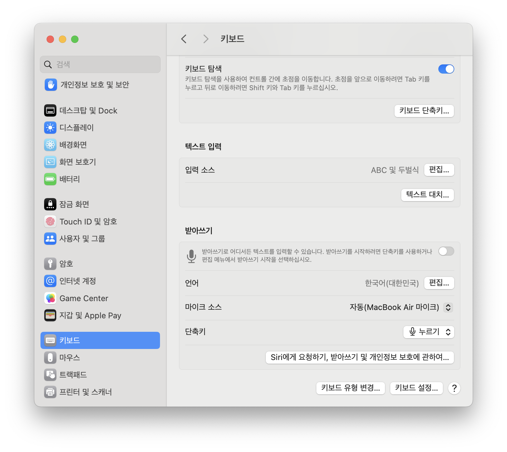
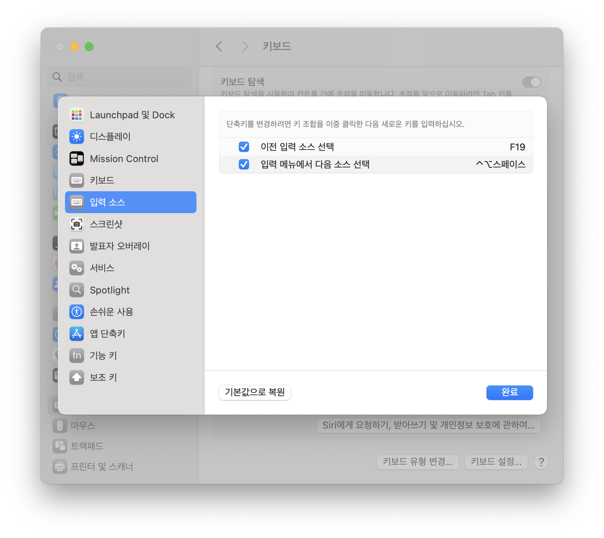

# Karabiner Configuration

## After Apply "Input Quick Swap"

+ Open `System Preferences` > `Keyboard`.
    
+ Open `Keyboard Shortcuts...` on `Keyboard` Configuration and Change `Select the previous input source` to `F19`.
  
